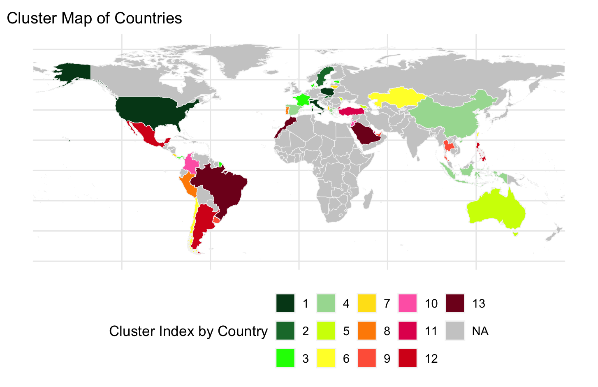
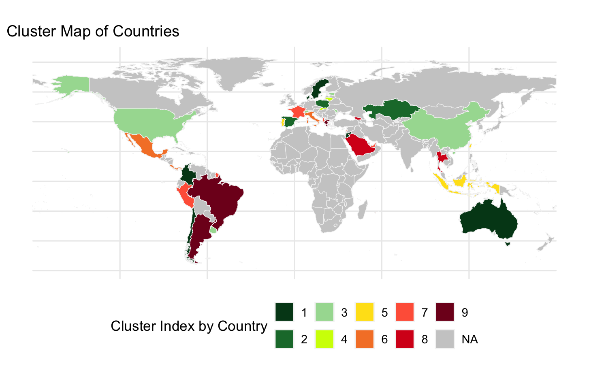

# Clustering Nations by Educational Performance  

> **Reference**: The second model for this project draws heavily on the concepts described in Rodriguez et al. (2008) on _The Nested Dirichlet Process_.
>
> We would also like to thank Alessandro Carminati and Alessandra Ragni for their help and guidance.
---

## Table of Contents  

1. [**Overview**](#1-overview)  
2. [**Bayesian Semiparametric Approach**](#2-bayesian-semiparametric-approach)  
3. [**Nested Dirichlet Process**](#3-nested-dirichlet-process)
4. [**Other Files**](#4-other-files)
5. [**Julia Setup**](#5-julia-setup)  
    - [Installing Julia on macOS](#installing-julia-on-macos)  
    - [Installing Julia on Windows](#installing-julia-on-windows)  
    - [Installing Julia on Linux](#installing-julia-on-linux)  
    - [Activating the Environment](#activating-the-environment)  
    - [Running Julia Scripts](#running-julia-scripts)  

---

## 1. Overview  

This project aims to cluster nations based on their educational performance using data from the OECD **Program for International Student Assessment (PISA)**. The dataset includes school and student questionnaires, providing a rich basis for probabilistic modeling.  

Two primary approaches are considered:  

1. **Bayesian Semiparametric Approach**
2. **Nested Dirichlet Process** 

---

## 2. Bayesian Semiparametric Approach  

**Model**  
```math
\begin{aligned}
y_{it} \mid \lambda_{it}&\stackrel{\text{ind}}{\sim} \mathcal{P}(\exp(X_{it}^T\beta + c_i + \log(T_{it})))\quad& i=1,\dots,n;\space t=1,\dots,n_i \\
\beta &\sim \mathcal{N}_p(0, \sigma_\beta^2 I_p), \\c_i \mid G &\stackrel{\text{iid}}{\sim} G & i=1,\dots,n\\
G &\sim \text{DP}(M, G_0)\\
G_0 &\sim \mathcal{N}(\mu_0, \sigma_0^2)
\end{aligned}
```
Where:  
- $M$: Precision parameter, controlling the variability of the Dirichlet process  
- $T_{it}$: Number of students in country *i* and school *t*  
- $\log(T_{it})$: Offset term to normalize the count data  
- $y_{it}$: Number of low-achieving students  
- $b_i$: Clustering component from the Dirichlet process, shared by subjects in the same cluster

**Results**



---

## 3. Nested Dirichlet Process  

**Model**  
```math
\begin{aligned}
    y_{ji} \mid {\theta_{ji}}, {\beta_j} &\overset{\text{ind}}{\sim} \mathcal{N} \big( \mu_{ji} + {X_{ji}}^T {\beta_j}, \sigma^2_{ji} \big), \quad &j = 1, \dots, J; \quad i = 1, \dots, I_j \\
    {\beta_j} &\overset{\text{iid}}{\sim} \mathcal{N}_p(0, \text{diag}(\sigma^2_{\beta})), \quad &j = 1, \dots, J \\
    {\theta_{ji}} \mid G_j &\overset{\text{ind}}{\sim} G_j, \quad &j = 1, \dots, J \\
    G_j &\overset{\text{iid}}{\sim} Q, \quad &j = 1, \dots, J \\
    Q &\sim \text{DP}(\alpha \text{DP}(\gamma G_0)) \\
    G_0 &\sim \text{NIG}(\mu_0, \lambda, a, b)
\end{aligned}
```
Where ${\theta_{ji}} = (\mu_{ji}, \sigma^2_{ji})$.

**Results**


---

## 4. Other files

The file `create_sorted_map.R` generates a world map where different clusters are represented using a gradient of colors. A greener color indicates higher educational performance.

In contrast, `map.ipynb` is a simplified version of the previous file. Instead of using a gradient, it assigns the same color to all countries within the same cluster.

---

## 5. Julia Setup  

### Installing Julia on macOS  

If you have Homebrew installed, run:  
```bash
brew install --cask julia
```
Otherwise, run:  
```bash
curl -fsSL https://install.julialang.org | sh
```

### Installing Julia on Windows  

Run:  
```bash
winget install julia -s msstore
```

### Installing Julia on Linux  

Run:  
```bash
curl -fsSL https://install.julialang.org | sh
```

### Activating the Environment  

Once Julia is installed, open a terminal, navigate to the project root, and run:  
```julia
using Pkg
Pkg.activate("julia_environment")
Pkg.instantiate()
```
Exit via `exit()`.  

### Running Julia Scripts  

Navigate to the project root and run:  
```bash
julia <fileName>.jl
```
Alternatively, you can run the files using **VSCode** or an IDE of your choice.  
